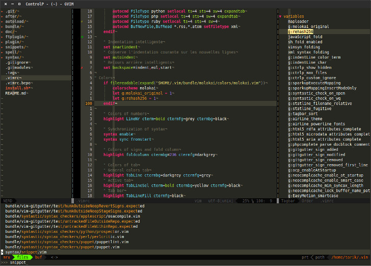

Tarik's Vim conf
================

Install
-------

To install this configuration, we need some steps:

One of the firsts steps it's to clone this repo obviously:

`git clone https://github.com/at-github/vim.git ~/.vim`

After that move to this directory
`cd ~/.vim`

and launch script install.sh
`./install.sh`

###What does this script

* Create a relative symlinc of the *.vimrc* in your home
* Create a relative symlinc of the *.nvimrc* in your home for neovim
* Get vundle plugin as submodule git
* Launch vim and install plugins with vundle method

Notes
-----

For better colors, set in your .bashrc or another file sourced by it:
`export TERM="screen-256color"`

Natively (without plugins)
--------------------------

###Shortcuts

####Leader
Is set on ","

####Moving copen and errors
* cprev  `<Leader>p`
* cfirst `<Leader>P`
* cnext  `<Leader>n`
* cLast  `<Leader>N`

####Moving visual selection
* Moving upper `<C-k>`
* Moving lower `<C-j>`
* Moving left  `<C-h>`
* Moving right `<C-l>`

####Switching hidden character visible
By default is it visible
`<c-l>`

####Folding - unfold current line / fold selection
`<space>`

####Spell check toggle
Dictionnary english and french as loaded
`<Leader>z`

####Move to definition/tag
* Jump to definition                     `<F1>`
* Jump to definition in vertical vsplit  `<F2>`
* Jump to definition in horizontal split `<F3>`
* Jump to definition in new tab split    `<F4>`

####Refresh
Refresh file in buffer `<F5>`

With plugins
------------

###Shortcuts

####Ctrl-p
Search tag using *Ctrl-p* `<space>p`

####NERDTree
Toggle *NERDTree* browser `<Leader>e`

####Tagbar
Toggle *Tagbar* `<Leader>t`

####NERDTree & Tagbar
Toggle relative *NERDTree* and *Tagbar* `<Leader><Space>`

####Sparkup
Use *Sparkup* after write `<c-e>`

####GitGutter
Toggle GitGutter highlight lines `<Leader>l`

####Easymotion
Use *Easymotion* search `<Leader>/`
